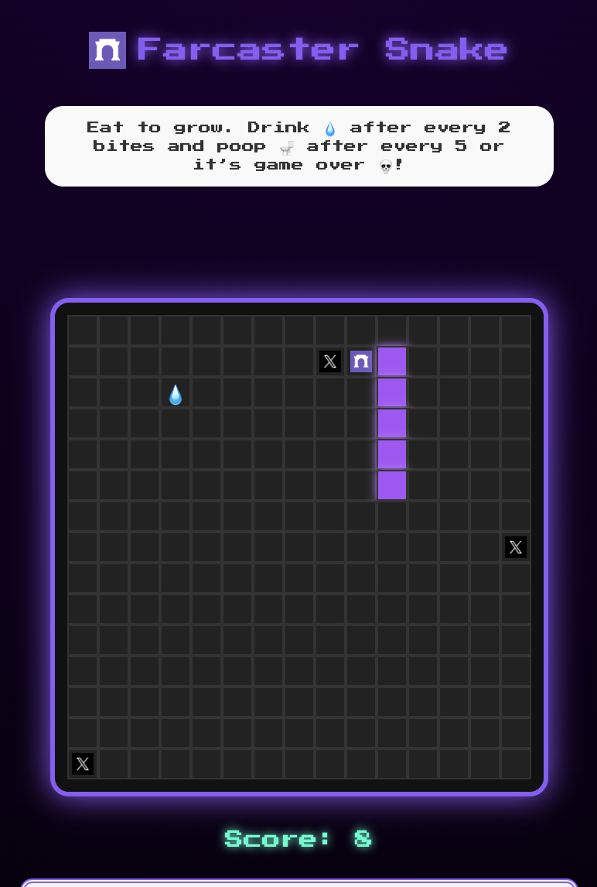

# 🐍 Farcaster Snake — Eat. Drink. Poop. Repeat.

A fun, meme-driven Web3 mini-game where survival depends on your rhythm:  
**Eat food 🍗, drink water 💧, and poop 🚽 — or it’s game over 💀.**

Built for Gen Z attention spans, powered by Farcaster, and designed for casual fun with a competitive edge.

---

## 🚀 Live Version (V1)

### 🎮 Game Rules

- **Eat** food by guiding your snake to it.
- After every **2 bites**, you must **drink water 💧**.
- After every **5 bites**, you need to **poop 🚽**.
- If you forget to hydrate or poop on time — **you die 💀**.

Simple. Silly. Addictive.

> `Eat • Hydrate • Poop • Repeat`

---

## 🧪 Coming Soon in V2

> This is just the beginning.

- 🧍 **Eat Your Followers**  
  The snake grows by consuming your Farcaster followers — survival is social.

- 🪙 **Tokenization**
  - Users can play for free.
  - Or pay a small **entry fee** to participate in a reward pool.
  - Score **> 50 points** to earn **$SNAKE** token.
  - The collected fees go into a **weekly reward pool**, claimable by top players based on share.

---

## 🧠 Built With

- ⚛️ React + Next.js App Router
- 🎮 Canvas Game Logic
- 🧑‍🚀 Farcaster + Neynar SDK
- 💅 TailwindCSS
- 🌚 Dark Mode Support
- 🪐 Powered by Neynar

---

## 📸 Preview



---

## 🛠 Local Development

```bash
git clone https://github.com/your-username/farcastersnake.git
cd farcastersnake
npm install
npm run dev
```
